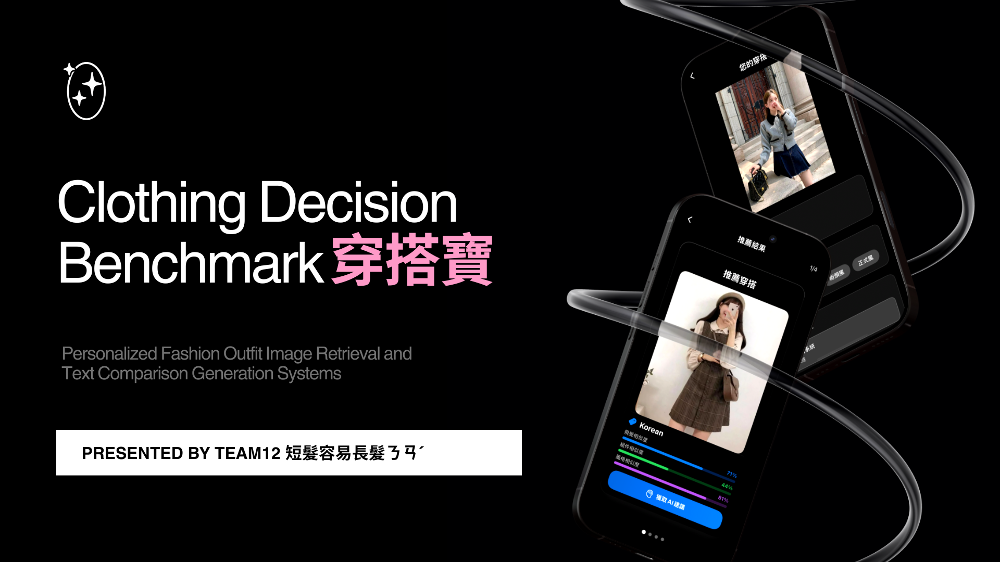

# Clothing Decision Benchmark ✨

## Background

Clothing Decision Benchmark (穿搭寶 / C.D.B.) is a project developed by [etoile_et_toi.mp3](https://github.com/etoile-et-toi-mp3), [slashotw](https://github.com/slashotw), [tingyun1412](https://github.com/tingyun1412), and [EthelHsiao](https://github.com/EthelHsiao) during the second semester of the 113 academic year (Feb. 2025 ~ Jun. 2025) as a final project for the "Introduction to Artificial Intelligence" course, which is instructed by A.P. Yu-Chun Yen (顏羽君) at National Yang Ming Chiao Tung University, Taiwan.

## Purpose

The purpose of this repository is to showcase the acquired skills of the authors and their capability of finishing a functionable project independently. By sharing this content openly, the repository aims to inspire discussions and spark new ideas related to the course's topics and tasks.

## Content

We are proposing a AI-powered project —— CDB —— that can help users improve their looks and appearance through suggesting similar but slightly-better outfits from our dataset.

We have two main stages working together in this project.

The first stage of the project is responsible for picking five (number can be specified) most similar pictures in the dataset to the user's given input. To choose the appropriate model and approach for this stage, we have conducted some experiments and compared their performance afterwards. The codes used can be found in this repo as well.

The second stage of this project is responsible for generating texts so that the user can know how to change their clothing 
components to look more similar to the suggested pictures.

Related source codes can be found in the directories above.

## Contact

If you have any questions or suggestions, feel free to contact the author via [email](mailto:willyfu0905.cs12@nycu.edu.tw).

## Slides

We also have prepared a [Presentation](https://www.canva.com/design/DAGpRUsVvz4/J7LZmdsA9lcImkqvaCerBg/edit) for this project.
